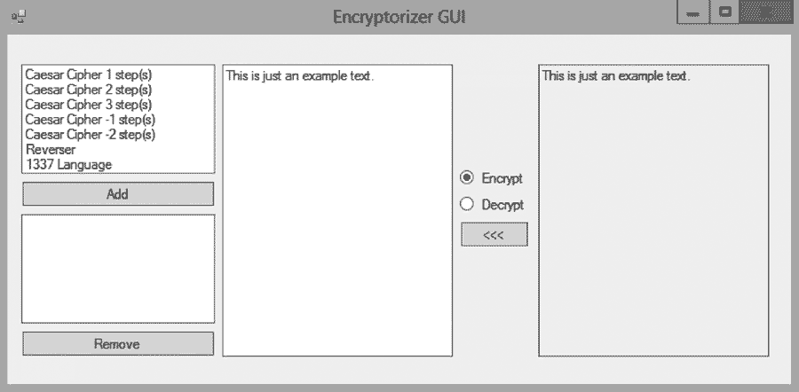

In this exercise we will be constructing the basic non-visual components of the application depicted in the GIF below:

## Our first cipher

1. Introduce a class called `CaesarCipher`.
1. Introduce a public instance method called `Encrypt` to the class `CasearCipher`. The method should expect a `string` and return a `string`.
1. The implementation `Encrypt` should follow the idea of a [1-step Caesar Cipher](https://en.wikipedia.org/wiki/Caesar_cipher). Meaning that every `"a"` in the string should be converted to a `"b"`, every `"b"` should be converted to a `"c"`, every `"c"` should be converted to a `"d"`, and so forth. When we reach `"z"` we must "wrap around" and convert to `"a"`. Note that case should be maintained.
1. Introduce a public instance method called `Decrypt` to the class `CaesarCipher`. This method should be the inverse of the method `Encrypt` such that `Decrypt(Encrypt(x)) == x`.
1. Ensure that both encrypting and decrypting works by instantiating the class `CaesarCipher` and then encrypting and decrypting a few strings.

## Parameterizing our cipher

1. Introduce a constructor with a single parameter to the class `CaesarCipher`. The type of the parameter should be `int`.
1. The value of the constructor parameter should determine the number of steps and the direction we take in the cipher. If for example the parameter is `2` then every `"a"` should, when encrypted, be converted to a `"c"` while when `-2` should be converted to `"y"`.
1. Ensure that both encrypting and decrypting works using multiple instances of the class `CaesarCipher` with different values passed to the constructor.

## Our second cipher

1. Introduce a class called `ReversalCipher`.
1. Introduce a public instance method called `Encrypt` to the class `ReversalCipher` and let it take a `string` and return a `string`. Its implementation should be such that it "reverses" every input string letter by letter. The string `"Hello world"` should for example be turned into `"dlrow olleH"`.
1. Introduce a public instance method called `Decrypt` to the class `ReversalCipher`. Its implementation should correspond to the inverse of `Encrypt`.

## Identifying commonality

1. In what ways are the two ciphers similar and in what ways are they different?
1. Introduce an `interface` called `ICipher`. The interface should declare two instance methods, `Encrypt` and `Decrypt`, that both take and return a single `string`.
1. Let the two cipher classes implement the interface `ICipher`.
1. Does the code compile? Why?
1. Name some benefits of letting the ciphers implement the interface `ICipher`.

## Ciphers of ciphers

1. Introduce a class called `MultiCipher`.
1. Add a constructor with two parameters to the class `MultiCipher`. The parameters should both be of type `ICipher`. The first parameter could be named `curr` (think: "current") and the second `nxt` (think: "next"). Both arguments should be saved to private instance variables.
1. Introduce a public instance method called `Encrypt` that takes and returns a `string`. The implementation should be such that it returns the result of first passing the input `string` through the method `Encrypt` on `curr` and then passing the result of that through the method `Encrypt` on `nxt`.
1. Show how to use the `MultiCipher` by instantiating it and running some encryptions.
1. Why can we not pass a `MultiCipher` to the constructor of `MultiCipher`? Why not?
1. Let `MultiCipher` implement the interface `ICipher`. Can we now pass a `MultiCipher` to the constructor of `MultiCipher`? Why?

## Cipher lists

1. Introduce a class called `CipherBuilder`.
1. Introduce an instance method called `FromList` to the class `CipherBuilder`. The method should take a `List<ICipher>` and return something of type `ICipher`. The implementation should be such that it runs through the list of ciphers and produces a `MultiCipher` that corresponds to that list.
1. The `CipherBuilder` is an immutable data type. What could a mutable version of `CipherBuilder` look like?
1. Introduce a public instance method to the class `MultiCipher` called `ToList`. The method should take no arguments but should return a value of type `List<ICipher>`. The method should "flatten" the `MultiCipher` such that if we would pass the resulting list through the instance method `FromList` then we would end up where we started.
1. Make use of both `FromList` and `ToList` to show that they work and that we can go back and forth using the two.
1. Assuming that `x` is a non-empty list of `ICipher`, why does `new CipherBuilder().FromList(x.ToList()) == x` evaluate to `false`?

## Additional ciphers

1. Introduce two new ciphers of your choice. Make sure that they implement the interface `ICipher`.
1. Introduce a new class called `NullCipher` that implements `ICipher`. This cipher simply passes through the string it encrypts without changing it. It can be thought of as the [identity function](https://en.wikipedia.org/wiki/Identity_function) for ciphers.
1. Use the `NullCipher` in `CipherBuilder` to avoid having to use `null`?

## Reflecting thoughts

1. Would it be preferable to use an abstract class or simply a class instead of `ICipher`? Why or why not?
1. What are the benefits of using the `NullCipher` in favor of `null`?

